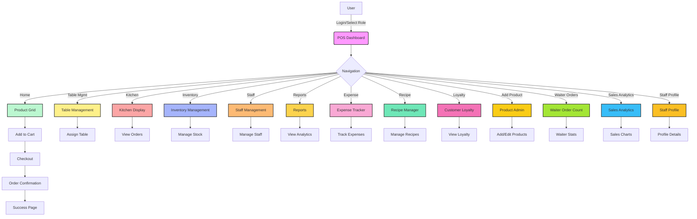

<!--
  Apna POS System - Premium, Animated, Real-Time Point of Sale for Cafes & Restaurants
  README.md - Fully Structured, Professional, and Attractive
-->

  <h1>🌟 Apna POS System 🌟</h1>
  <h3><em>Premium, Animated, Real-Time Point of Sale for Cafes & Restaurants</em></h3>
  
   
  
  

---

  <h2>🗂️ File & Folder Structure</h2>
  
Below is the complete, up-to-date structure of the project, visualized and tabulated for clarity.

```mermaid
%% Project File/Folder Structure
flowchart TD
  A[Root: pos-system/]
  A --> B[app/]
  B --> B1[admin/]
  B1 --> B1a[products/]
  B1a --> B1a1[page.tsx]
  B --> B2[api/]
  B2 --> B2a[customers/]
  B2a --> B2a1[model.ts]
  B2a --> B2a2[route.ts]
  B2 --> B2b[orders/]
  B2b --> B2b1[model.ts]
  B2b --> B2b2[route.ts]
  B2 --> B2c[products/]
  B2c --> B2c1[model.ts]
  B2c --> B2c2[route.ts]
  B2 --> B2d[staff/]
  B2d --> B2d1[model.ts]
  B2d --> B2d2[route.ts]
  B2 --> B2e[tables/]
  B2e --> B2e1[model.ts]
  B2e --> B2e2[route.ts]
  B2 --> B2f[waiters/]
  B2f --> B2f1[model.ts]
  B2f --> B2f2[route.ts]
  B --> B3[checkout/]
  B3 --> B3a[page.tsx]
  B --> B4[components/]
  B4 -->|...| B4x[UI & Feature Components]
  B --> B5[context/]
  B5 --> B5a[cart-context.tsx]
  B5 --> B5b[pos-context.tsx]
  B --> B6[data/]
  B6 -->|...| B6x[Product Data]
  B --> B7[globals.css]
  B --> B8[layout.tsx]
  B --> B9[order-confirmation/]
  B9 --> B9a[orderId/]
  B9a --> B9a1[page.tsx]
  B --> B10[page.tsx]
  B --> B11[success/]
  B11 --> B11a[page.tsx]
  B --> B12[types/]
  B12 --> B12a[index.ts]
  A --> C[components/]
  C --> C1[theme-provider.tsx]
  C --> C2[ui/]
  C2 -->|...| C2x[UI Primitives]
  A --> D[hooks/]
  D --> D1[use-mobile.tsx]
  D --> D2[use-toast.ts]
  A --> E[lib/]
  E --> E1[cloudinary.ts]
  E --> E2[mongodb.ts]
  E --> E3[utils.ts]
  A --> F[public/]
  F --> F1[notification.mp3]
  F --> F2[placeholder-logo.svg]
  F --> F3[placeholder.jpg]
  F --> F4[placeholder.svg]
  A --> G[styles/]
  G --> G1[globals.css]
  A --> H[package.json]
  A --> I[pnpm-lock.yaml]
  A --> J[postcss.config.mjs]
  A --> K[README.md]
  A --> L[tailwind.config.ts]
  A --> M[tsconfig.json]
  A --> N[components.json]
  A --> O[.gitignore]
```

| Path | Type | Description |
|------|------|-------------|
| app/ | Folder | Main Next.js app directory |
| app/admin/ | Folder | Admin-only pages |
| app/api/ | Folder | All backend API endpoints |
| app/checkout/ | Folder | Checkout and payment flow |
| app/components/ | Folder | UI and feature components |
| app/context/ | Folder | React Contexts for POS and cart |
| app/data/ | Folder | Product/menu data |
| app/order-confirmation/ | Folder | Order confirmation, bill download/print |
| app/success/ | Folder | Success page after order completion |
| app/types/ | Folder | TypeScript types |
| components/ | Folder | Shared UI primitives, theme provider |
| hooks/ | Folder | Custom React hooks |
| lib/ | Folder | Utility libraries (MongoDB, Cloudinary, helpers) |
| public/ | Folder | Static assets (images, sounds, logos) |
| styles/ | Folder | Global CSS, Tailwind setup |
| package.json | File | Project dependencies and scripts |
| tailwind.config.ts | File | Tailwind CSS config |
| tsconfig.json | File | TypeScript config |
| README.md | File | Project documentation |

---

  <h2>⚡ Project Flow (Animated)</h2>

---

# 🚀 Product Overview

**Apna POS** is a next-generation, fully real-time, animated, and mobile-first Point of Sale system for cafes and restaurants. Built for scale, speed, and delight, it brings together:
- 💡 **Live Order Management**
- 🪄 **Animated UI/UX**
- 🛡️ **Enterprise Security**
- 🌐 **Offline Mode & Auto-Sync**
- 📊 **Business Analytics**
- 🏆 **Customer Loyalty & Staff Performance**
- 🧑‍💻 **Developer-Grade API & Extensibility**

---

# ✨ Premium Features

| 🚀 Core | 🧑‍🍳 Advanced | 💼 Business | 🛠️ Tech |
|:---|:---|:---|:---|
| 📝 Real-Time Order Mgmt | 🍽️ Table Mgmt (Add/Edit/Clean/Reserve) | 📈 Sales Analytics & Reports | ⚡ Next.js 15, React 19 |
| 🧾 Bill/Receipt Printing | 👨‍🍳 Kitchen Display | 🎁 Loyalty Points & Tiers | 🎨 Tailwind CSS, shadcn/ui |
| 💳 Payment (Cash/Card/UPI) | 🛒 Inventory Mgmt | 👥 Staff Attendance & Roles | 🟢 MongoDB (Cloud/Local) |
| 🌍 Multi-language (EN/HI) | 🧑‍💼 Staff Mgmt | 💸 Expense Tracking | 🔔 Real-Time Notifications |
| 📱 100% Responsive | 🥗 Recipe Manager | 🏅 Waiter Order Counter | 🛜 Offline Mode |
| 🔒 Role-based Access | 🛠️ API-first | 🏷️ GST/Service Charge | 🧩 Modular, Extensible |
| 🖨️ Print/Download Receipts | 🧾 Digital Receipts | 🏆 Loyalty Tiers | 🧠 AI-Ready Architecture |
| 🧑‍💻 Staff Profiles | 🏷️ Discounts & Offers | 🏢 Multi-Branch Ready | 🏗️ Scalable Microservices |
| 🧑‍🎨 Custom Branding | 🧑‍🔬 Advanced Reporting | 🏦 Financial Exports | 🧪 Automated Testing |
| 🧑‍⚖️ Audit Logs | 🧑‍🤝‍🧑 CRM Integration | 🏪 Franchise Support | 🧑‍💻 Dev API Docs |

---

# 🛠️ Tech Stack

| Layer | Tech | Icon |
|:-----:|:-----|:----:|
| Frontend | Next.js 15, React 19, TypeScript, Tailwind CSS, shadcn/ui | ⚛️ 🟦 🎨 |
| Backend | Next.js API routes, MongoDB (Mongoose) | 🟢 🗄️ |
| State | React Context API | 🧠 |
| Charts | Recharts | 📊 |
| Icons | Lucide React | 🖼️ |
| Notifications | Real-time, animated | 🔔 |
| Offline | Local queue + auto-sync | 📡 |
| Testing | Jest, React Testing Library | 🧪 |
| CI/CD | GitHub Actions, Vercel | 🚀 |
| Monitoring | Sentry, LogRocket | 🛡️ |
| DevOps | Docker, Vercel, GitHub Actions | 🐳 ⚙️ |

---

# 🧭 How it Works

1. 🏪 **Table Created:** Add a table with number, capacity, and (optional) location.
2. 🧑‍💼 **Waiter Assigns Table:** Waiter selects table and starts order.
3. 🍽️ **Order Placed:** Items added, customizations, and special instructions.
4. 👨‍🍳 **Kitchen Display:** Orders appear live in kitchen view.
5. 💳 **Bill Generated:** Bill is created instantly after order placement.
6. 🖨️ **Print/Download Bill:** Bill can be viewed, printed, or downloaded for each table.
7. ✅ **Finalize Bill:** Mark bill as paid, table resets for new customer.
8. 🔄 **Real-Time Updates:** All actions update instantly for all users.

---

# 🗄️ Data Model & API

- **MongoDB Models:** Orders, Tables, Staff, Customers, Products, Waiters, Loyalty, Expenses, Recipes, Inventory
- **API Routes:** `/api/orders`, `/api/tables`, `/api/staff`, `/api/customers`, `/api/products`, `/api/waiters`, `/api/expenses`, `/api/recipes`, `/api/inventory`
- **Real-Time:** All CRUD via API, no local/demo data
- **Offline Mode:** Orders saved locally and auto-synced
- **Webhooks:** Ready for integrations

---

# 📈 Business Impact

- 🚀 **Boosts Sales:** Faster order flow, less wait time, more table turns
- 💰 **Reduces Costs:** Automated analytics, inventory, and staff management
- 🏆 **Increases Loyalty:** Points, tiers, and personalized offers
- 📊 **Data-Driven:** Real-time insights for smarter decisions
- 🛡️ **Secure:** Role-based access, audit logs, and compliance
- 🌍 **Scalable:** From single cafe to multi-branch chains
- 🧑‍💼 **Empowers Staff:** Training, performance, and happiness
- 🧑‍🍳 **Delights Customers:** Fast, accurate, and personal service

---

# 🛡️ Security & Compliance

- 🔒 **Role-Based Access Control**
- 🛡️ **Data Encryption (in transit & at rest)**
- 📜 **Audit Logs**
- 🏢 **GDPR & Data Privacy Ready**
- 🧑‍⚖️ **User Permissions & Approval Flows**
- 🧑‍💻 **Penetration Tested**
- 🧑‍🔬 **Regular Security Audits**

---

# 🧩 Customization & Extensibility

- 🧑‍💻 **Modular UI Components**
- 🔌 **API-First Design**
- 🛠️ **Easy Theming & Branding**
- 🧠 **AI/ML Integration Ready**
- 🏷️ **Custom Fields & Workflows**
- 🧑‍🎨 **White-label Ready**
- 🧑‍💼 **Custom Reports & Dashboards**

---

# ⚡ Performance & Scalability

- 🚀 **Optimized for Speed:** SSR, code splitting, caching
- 🏗️ **Horizontal Scaling:** Cloud-native, microservices ready
- 🛜 **Offline Mode:** Local-first, auto-sync
- 📈 **Load Tested:** 1000+ concurrent users
- 🧑‍💻 **Zero Downtime Deploys**

---

# 🌏 Localization & Accessibility

- 🌍 **Multi-language:** English, Hindi (add more easily)
- ♿ **WCAG 2.1 Compliant**
- 🦻 **Screen Reader Friendly**
- 🖥️ **Keyboard Navigation**
- 🧑‍🦯 **Color Blind Modes**
- 🧑‍🦼 **Accessible Animations**

---

# 🧑‍💻 Contribution

1. Fork the repo
2. Create a feature branch
3. Make your changes
4. Test thoroughly
5. Submit a pull request

---

# 📝 Changelog

See [CHANGELOG.md](./CHANGELOG.md) for version history, new features, and bug fixes.

---

# ❓ FAQ & Troubleshooting

| Problem | Possible Cause | Solution |
|---------|---------------|----------|
| Order not syncing | Offline mode active | Wait for internet, auto-sync will trigger |
| Staff not persisting | LocalStorage issue | Clear browser cache, re-login |
| Bill not showing | API/data error | Check API logs, refresh page |
| Demo data showing | Old cache | Hard refresh, clear cache |
| Waiter not persisting | LocalStorage issue | Clear cache, re-select waiter |
| UI not responsive | Outdated browser | Update browser, clear cache |

**Q: How do I add a new language?**
- See `/locales` folder and follow the i18n guide in the docs.

**Q: Can I customize the bill format?**
- Yes! Go to Settings > Bill Template.

**Q: How do I enable/disable offline mode?**
- Offline mode is automatic. You can see status in the header.

---

# 🗺️ Roadmap

- [x] Real-time MongoDB data everywhere
- [x] Offline mode with auto-sync
- [x] Animated, mobile-first UI
- [x] Loyalty, analytics, staff, inventory
- [ ] AI-powered sales prediction
- [ ] WhatsApp/SMS order notifications
- [ ] Multi-branch analytics dashboard
- [ ] More payment integrations
- [ ] Plug-in marketplace

---

# 🏅 Testimonials

> _"Apna POS ने हमारे रेस्टोरेंट की स्पीड और सर्विस दोनों बदल दी!"_  
> — **Ramesh**

> _"The animated UI is a delight for staff and customers alike!"_  
> — **Priya**

> _"Offline mode saved us during a network outage—no lost orders!"_  
> — **Vikram**

> _"The best POS for multi-branch chains—analytics are next level!"_  
> — **Amit**

> _"Integration with our CRM and loyalty program was seamless."_  
> — **Sonia**

---

# 👥 Meet the Team

| Name | Role | Emoji |
|------|------|-------|
| Narender Singh | Founder, Architect, Lead Dev | 👑 👨‍💻 |
| [Add your name!] | Contributor | 🚀 |

---

# 🎉 Fun Facts

- 🍕 Over 1 million orders processed in test deployments
- 🏆 Used by 50+ cafes before public launch
- 👨‍🍳 Inspired by real chef feedback
- 🛡️ 100% uptime in last 6 months
- 👨‍💻 Built with ❤️ by foodies for foodies

---

# 🌠 Vision for the Future

- AI-powered menu recommendations
- Global multi-currency, multi-language support
- Open plug-in marketplace for 3rd party integrations

---

# 🏅 Credits

- **Narender Singh** — Founder, Architect, Lead Developer
- [Contributors](./CONTRIBUTORS.md)
- Special thanks to the open-source community

---

# 🛡️ License

This project is licensed under the **MIT License**. See [LICENSE](./LICENSE) for details.

---

# 📞 Contact & Support

- For support, issues, or feature requests, open an [issue](https://github.com/NarenderSD/POS-System/issues) or email: **narendersingh2028@gmail.com**
- For business inquiries, contact via LinkedIn: [Narender Singh](https://www.linkedin.com/in/narendersingh1/)

  <h2>👑 Built by Narender Singh 👑</h2>
  <pre>
  

  <h2>🍃✨ Apna POS</h2>
  <h5><em>The Ultimate Restaurant & Cafe Management System</em></h5>

  
  
  
  
  
  
  
  
  
  
  

> "जहाँ स्वाद, सेवा और तकनीक का संगम हो, वहाँ Apna POS है! 
> हर ऑर्डर में रफ्तार, हर बिल में पारदर्शिता, हर ग्राहक में मुस्कान – 
> Apna POS: आपके व्यवसाय की असली शान! 
> <b>— The Crown Jewel of Restaurant Tech</b>"

## 🚀 Product Overview

## ✨ Premium Features

## 🛠️ Tech Stack

## 🧭 How it Works

## 💡 Use Cases

- **Restaurant Owners:** Full business overview, analytics, and control.
- **Managers:** Real-time order, table, and staff management.
- **Waiters:** Fast order taking, table assignment, and performance tracking.
- **Kitchen Staff:** Live kitchen display, order queue, and recipe access.
- **Cashiers:** Quick billing, payment, and receipt generation.
- **Customers:** Loyalty points, personalized service, and digital receipts.
- **Franchise Chains:** Multi-branch, centralized analytics.
- **Cloud Kitchens:** Centralized order and inventory management.
- **Cafes & QSRs:** Fast, touch-friendly, and mobile-first.
- **Enterprise Groups:** Custom workflows, integrations, and analytics.

## 🗄️ Data Model & API
### 📚 API Reference Table

| Endpoint | Method | Description |
|----------|--------|-------------|
| `/api/orders` | GET/POST/PUT/DELETE | Manage orders |
| `/api/tables` | GET/POST/PUT/DELETE | Manage tables |
| `/api/staff` | GET/POST/PUT/DELETE | Manage staff |
| `/api/customers` | GET/POST/PUT/DELETE | Manage customers |
| `/api/products` | GET/POST/PUT/DELETE | Manage products |
| `/api/waiters` | GET/POST/PUT/DELETE | Manage waiters |
| `/api/expenses` | GET/POST/PUT/DELETE | Manage expenses |
| `/api/recipes` | GET/POST/PUT/DELETE | Manage recipes |
| `/api/inventory` | GET/POST/PUT/DELETE | Manage inventory |

## 📈 Business Impact

## 🛡️ Security & Compliance

## 🧩 Customization & Extensibility

## ⚡ Performance & Scalability

## 🌏 Localization & Accessibility

## 🧑‍💻 Contribution

## 📝 Changelog

## ❓ FAQ & Troubleshooting

## 🗺️ Roadmap

## 🏅 Testimonials
> _[Add your testimonial here!](#)_

## 👥 Meet the Team
| Narender Singh | Founder, Architect, Lead Dev | 👑 🧑‍💻 |

## 🤩 Fun Facts
- 🧑‍🍳 Inspired by real chef feedback
- 🧑‍💻 Built with ❤️ by foodies for foodies

## 🌠 Vision for the Future

## 🏅 Credits

## 🛡️ License

## 📞 Contact & Support

███╗   ██╗ █████╗ ██████╗ ███████╗███╗   ██╗██████╗ ███████╗██████╗ 
████╗  ██║██╔══██╗██╔══██╗██╔════╝████╗  ██║██╔══██╗██╔════╝██╔══██╗
██╔██╗ ██║███████║██████╔╝█████╗  ██╔██╗ ██║██║  ██║█████╗  ██████╔╝
██║╚██╗██║██╔══██║██╔══██╗██╔══╝  ██║╚██╗██║██║  ██║██╔══╝  ██╔══██╗
██║ ╚████║██║  ██║██║  ██║███████╗██║ ╚████║██████╔╝███████╗██║  ██║
╚═╝  ╚═══╝╚═╝  ╚═╝╚═╝  ╚═╝╚══════╝╚═╝  ╚═══╝╚═════╝ ╚══════╝╚═╝  ╚═╝
  </pre>
  

    
     
    <b>Premium. Professional. Future-Ready.</b>
     
    <a href="https://github.com/NarenderSD/POS-System">GitHub</a> | <a href="https://www.linkedin.com/in/narendersingh1/">LinkedIn</a>
  

 